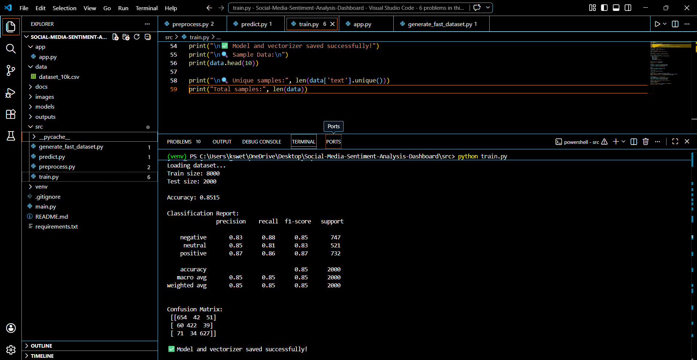
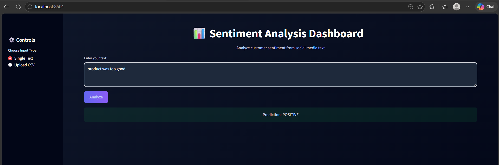
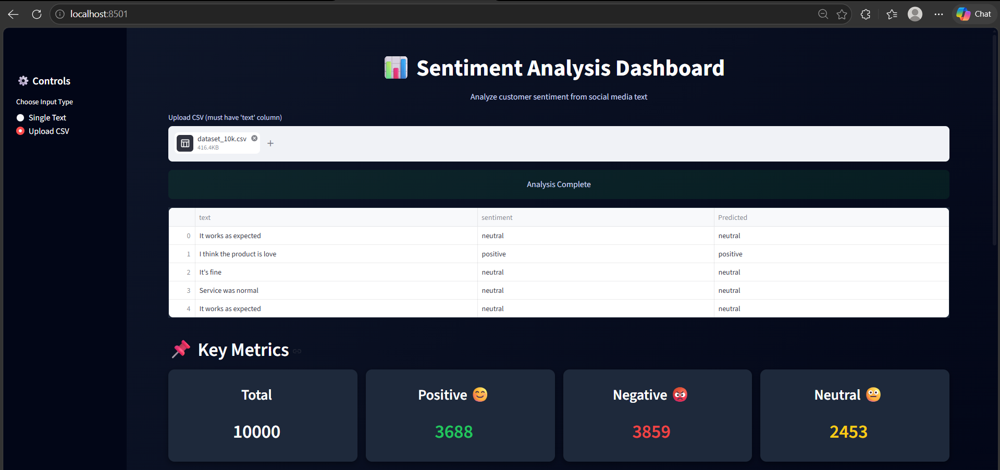
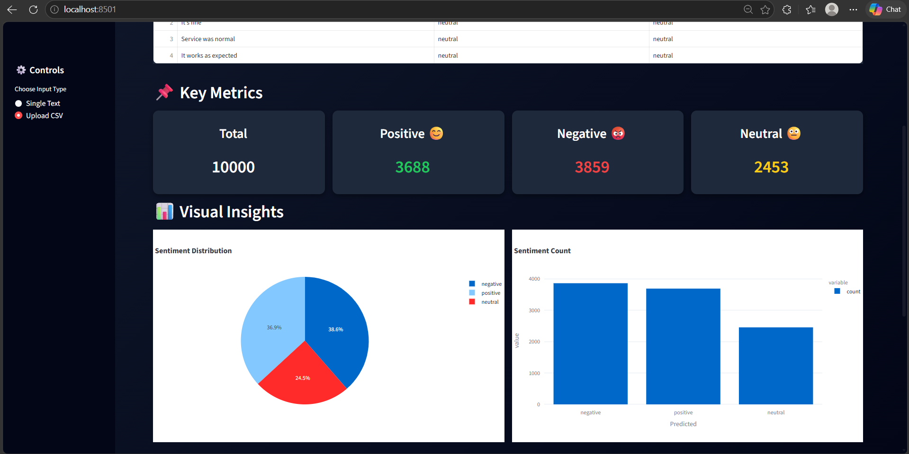

# 📊 Social Media Sentiment Analysis Dashboard

A complete **Machine Learning + Streamlit dashboard project** that analyzes social media text and classifies sentiment into **Positive 😊, Negative 😡, and Neutral 😐** with an interactive and visually appealing UI.

---

## 🚀 Features

* 🔍 Real-time sentiment prediction (Single text input)
* 📁 Bulk analysis using CSV upload
* 📊 Interactive dashboard with:

  * Key Performance Indicators (KPIs)
  * Sentiment distribution (Pie chart)
  * Sentiment comparison (Bar chart)
* 📈 Data visualization using Plotly
* 🧠 Machine Learning model trained on 10,000 samples
* 🎨 Modern dark-themed UI using Streamlit customization

---

## 🛠️ Tech Stack

* **Python**
* **Machine Learning** (Scikit-learn)
* **Streamlit** (Dashboard UI)
* **Pandas & NumPy**
* **Plotly** (Visualization)
* **Joblib** (Model saving/loading)

---

## 📂 Project Structure

```
Social-Media-Sentiment-Analysis-Dashboard/
│
├── app/
│   └── app.py                # Streamlit Dashboard
│
├── src/
│   ├── train.py             # Model training
│   ├── predict.py           # Prediction logic
│   ├── preprocess.py        # Text preprocessing
│   └── generate_fast_dataset.py
│
├── models/
│   ├── model.pkl
│   └── vectorizer.pkl
│
├── data/
│   └── dataset_10k.csv
│
├── images/                  # Screenshots for README
│   ├── output.png
│   ├── dashboard.png
│   ├── dashboard_kpi.png
│   └── dashboard_charts.png
│
├── requirements.txt
└── README.md
```

---

## 📸 Screenshots

### 🔹 Model Output



### 🔹 Dashboard Overview



### 🔹 KPI Section



### 🔹 Charts & Visualization



---

## ⚙️ Installation & Setup

### 1️⃣ Clone the Repository

```bash
git clone https://github.com/Swetha07062003/social-media-sentiment-dashboard.git
cd social-media-sentiment-dashboard
```

---

### 2️⃣ Create Virtual Environment

```bash
python -m venv venv
venv\Scripts\activate   # Windows
```

---

### 3️⃣ Install Dependencies

```bash
pip install -r requirements.txt
```

---

### 4️⃣ Run the Application

```bash
streamlit run app/app.py
```

---

## 📊 Dataset

* Total Samples: **10,000**
* Unique Samples: **343**
* Sentiment Classes:

  * Positive
  * Negative
  * Neutral

---

## 🧠 Model Performance

* ✅ Accuracy: **83%**


---

## 📌 Future Improvements

* 🔹 Use real-world dataset (Twitter/Reddit API)
* 🔹 Deep Learning models (LSTM / BERT)
* 🔹 Live sentiment tracking
* 🔹 Deployment on cloud (AWS / Streamlit Cloud)

---

## 👩‍💻 Author

**Swetha K**

---

